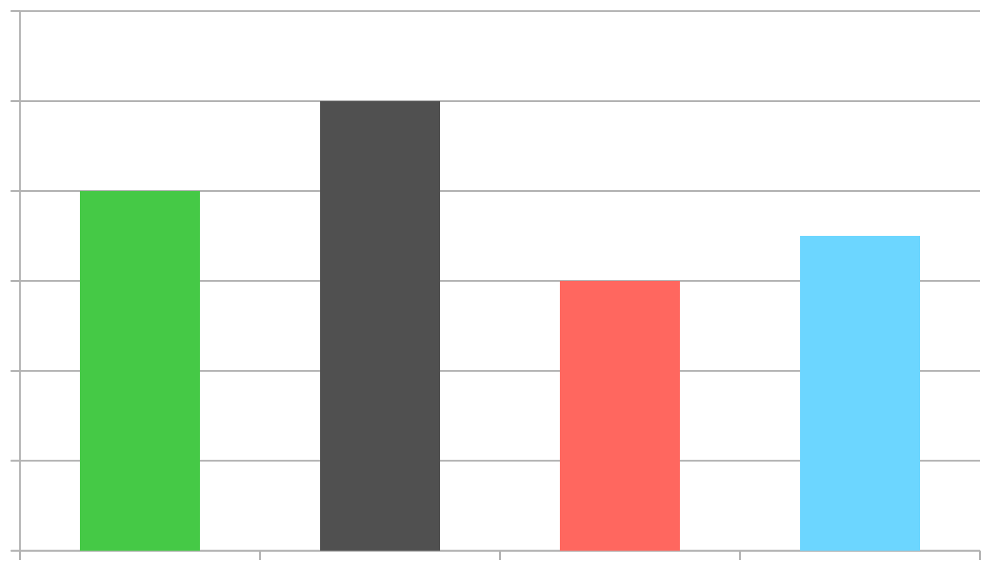
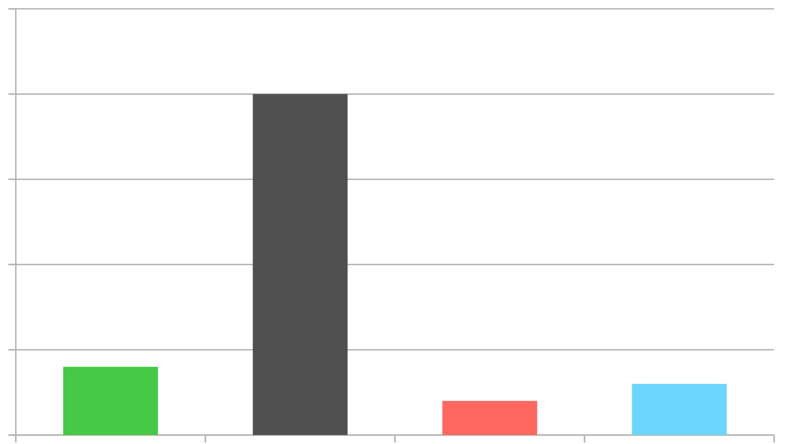
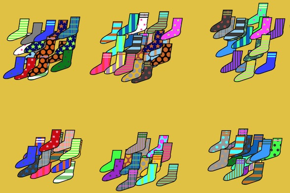

+++
title="The Essence of Information"
date=2017-03-18
+++

People look confused when I tell them about my passion for algorithms and data-structures.
Most of them understand what a Programmer is doing, but not what Computer Science is good for.
And even if they do, they think it has no practical relevance.
Let me show you with a simple example, that applied Computer Science can be found everywhere.

Imagine a pile of socks that need to get sorted.
Not exactly the most exciting pastime.
You've put off this task for so long, that it will inevitably take an hour to be done.

{{ figure(src="./big_pile.jpg", caption="Yes, there is a game about sorting socks." credits="It's called [Sort the Socks](https://itunes.apple.com/app/sort-the-socks/id438108346) and you can get it for free on the App Store.") }}

Considering your options, you decide to get some help.
Together with a friend you get to work. You finish in roughly half the time.

A Computer Scientist might call this pile of socks a *resource*.
You and your friend get bluntly degraded to *workers*.
Both of you can work on the problem at the same time &mdash; or *in parallel*.
This is the gist of [Parallel Computing](https://en.wikipedia.org/wiki/Parallel_computing).

Now, some properties make sock-sorting a good fit for doing in parallel.

* The work can be nicely split up. It takes about the same time for every worker to find a pair of socks.
* Finding a different pair is a completely separate task that can happen at the same time.

The more workers you assign to this task, the faster you're done.

* 1 worker takes 60 minutes.
* 2 workers take 30 minutes.

How long will 3 workers take? Right! Around 20 minutes. We could write down
a simple formula for this relationship:  

 

Well, that is not quite correct. We forgot to consider the [overhead](https://en.wikipedia.org/wiki/Overhead_(computing)): When Mary
tries to pick up a sock, Stephen might reach for the same.
They both smile and one of them picks another sock.
In computing, a worker might do the same. Well, not smiling but picking another
task. When lots of workers share resources, these situations occur quite
frequently. And resolving the situation always takes a little extra time. So we are a
bit away from our optimal sorting speed because of that.

But it gets worse! Let's say you have 100 workers for 100 socks.
In the beginning, every worker might take one sock and try to find a match for
it. Here's the problem: As soon as they pick up one sock each, there are no
socks left. All workers are in a waiting state. The sorting takes forever.
That's a [deadlock](https://en.wikipedia.org/wiki/Deadlock), and it's one of the most frightening scenarios of parallel computing.

In this case, a simple solution is to put down the sock again and wait for some time until trying to get a new sock.
Another way out of the dilemma would be, to enforce some kind of "protocol" for sorting. 
Think of a protocol as a silent agreement between the workers on how to achieve a common goal.

So, in our case, each worker might only be responsible for one color of socks.
Worker one takes the green socks, worker two the gray ones and so on.
With this simple trick, we can avoid a deadlock, because we work on completely
separate tasks.

But there's still a catch. What if there are only four green socks and 4000 gray socks?
Worker one would get bored fairly quickly. He would sort the two pairs of socks in
no time and then watch worker two sort the rest.
That's not really team spirit, is it?

Splitting up the work like this makes most sense, if we can assume that we
have around the same number of socks for every color.
This way we achieve roughly the same workload for
everyone.

The following histogram gives you an idea of what I mean:

In this case, we have about equally sized piles for each color. Looks
like a fair workload for every worker to me.

In the second case, we don't have an equal distribution. I don't want to sort the
gray socks in this example. We need to think a little harder here.

What can we do?

Most of the time it helps to think of other ways to split up work.
For example, we could have *two* workers sort the big gray pile together. One
sorts the large socks; the other one sorts the small ones. We run into another problem, though: Who decides what "large" and "small" means in this case?

So, instead of thinking too hard about a smarter approach, we decide to be
pragmatic here. Everyone just grabs an equally sized pile of socks &mdash; no
matter the color or the size &mdash; and gets
to work.

Most likely, there will be some remaining socks in each pile, which have no match.
That's fine. We just throw them all together, mix the socks, create new piles from
that, and sort them again. We do so until we're done.
We call that a [task queue](https://en.wikipedia.org/wiki/Scheduling_(computing)#task_queue). It has two advantages: First, you don't need any additional agreements between the workers and second, it scales reasonably
well with the number of workers without thinking too hard about the problem
domain.

The tricky part about distributed systems is, that seemingly straightforward solutions can fail
miserably in practice.

What if our small piles look like this?

 

The number of pairs in each pile is... sobering.
What we could do is run a very quick presorting step to increase the number of matches. Or maybe you come up with an even better idea?  
The cool thing is, once you have found a faster approach, it works for similar tasks, too.

Problems like this have their roots in Computer Science, and they can be found everywhere.
Personally, I don't like the term Computer Science too much. I prefer
the German term "Informatik", which I would roughly translate as "Information Science".
Because the real essence of what we're doing here is to find a general way to solve a
whole *class* of problems. We think of the nature of objects and their properties.
We don't sort socks; we try to answer the [fundamental questions of information](https://www.youtube.com/watch?v=2Op3QLzMgSY). Maybe now you can understand why I'm so passionate about this subject.

Oh, and here's a related post about [why I love programming](@/2017/why-i-love-programming/index.md).

